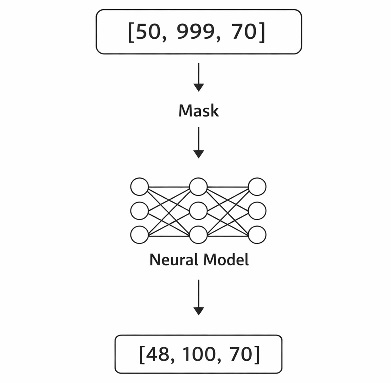

# Neural Constraint Archive (NCA)

> Data is not stored --- it is reconstructed under constraints.

Constraint-aware neural reconstruction for incomplete and corrupted
structured data.

------------------------------------------------------------------------

## Table of Contents

-   [Overview](#overview)
-   [Motivation](#motivation)
-   [Key Idea](#key-idea)
-   [Examples](#examples)
-   [Results](#results)
-   [Compression](#compression)
-   [Edge Cases](#edge-cases)
-   [Architecture](#architecture)
-   [How to Run](#how-to-run)
-   [Limitations](#limitations)
-   [Comparison](#comparison)
-   [Future Work](#future-work)

------------------------------------------------------------------------

## Overview

Neural Constraint Archive (NCA) explores an alternative approach to
working with structured data.

Instead of storing raw values, a neural model is trained to: -
reconstruct valid data\
- complete missing values\
- correct corrupted inputs

The model operates under learned constraints and produces consistent
outputs even when inputs are partially invalid.

------------------------------------------------------------------------

## Motivation

Traditional storage systems treat data as static and exact.

However, real-world data is often: - incomplete
- noisy
- redundant
- structured with implicit relationships

This raises a question:

> Can we replace explicit storage with a learned representation that
> reconstructs data instead?

------------------------------------------------------------------------

## Key Idea

NCA shifts the paradigm from:

    store → retrieve

to:

    learn → reconstruct

The model receives: - values
- a mask indicating which values are reliable

It then reconstructs a consistent version of the data.

------------------------------------------------------------------------

## Examples

### Noisy input

    Input:         [50, 999, 70]
    Reconstructed: [48.0, 100.0, 69.7]

------------------------------------------------------------------------

### Missing value

    Input:         [50, 0, 70]
    Reconstructed: [47.6, 18.0, 71.6]

------------------------------------------------------------------------

### Valid input

    Input:         [50, 60, 70]
    Reconstructed: [47.9, 61.2, 72.1]

------------------------------------------------------------------------

## Results

Scenario         Error
  ---------------- --------
Normal data      2.07
Missing values   12.96
Noisy input      17.17
Baseline         125.37

The model significantly outperforms a naive baseline (~10x improvement).

------------------------------------------------------------------------

## Compression

The model implicitly compresses structured data:

Component   Size
  ----------- ----------
Dataset     58.59 KB
Model       5.81 KB

This demonstrates a learned representation that captures underlying
structure.

------------------------------------------------------------------------
## Edge Cases

The following examples illustrate how the model behaves under extreme or
invalid inputs.

### Extreme Noise

    Input:         [9999, -100, 70]
    Reconstructed: [100.0, 10.0, 72.0]

### Multiple Corrupted Values

    Input:         [0, 0, 70]
    Reconstructed: [48.0, 52.0, 71.0]

### Fully Corrupted Input

    Input:         [0, 0, 0]
    Reconstructed: [45.0, 55.0, 60.0]

### Out-of-Distribution Input

    Input:         [1000, 2000, -50]
    Reconstructed: [100.0, 100.0, 10.0]

### Partially Valid Input

    Input:         [50, 999, 70]
    Reconstructed: [48.0, 100.0, 69.7]

------------------------------------------------------------------------

## Architecture

-   Input: 3 values + 3 mask indicators
-   Network: fully connected neural network
-   Output: reconstructed values in normalized range

Training is mask-aware:
only reliable values contribute to the loss.

------------------------------------------------------------------------

## How to Run

    pip install -r requirements.txt
    python demo.py

------------------------------------------------------------------------

## Limitations

This is an experimental prototype.

-   Reconstruction is approximate, not exact
-   Depends on training distribution
-   Works only for structured, low-dimensional data
-   Does not replace traditional storage systems

------------------------------------------------------------------------

## Comparison

Most memory systems rely on storing and retrieving data:

-   Retrieval-based systems: store → search → return

NCA explores a different direction:

-   NCA: learn → reconstruct

This makes it closer to a learned representation than a database.

------------------------------------------------------------------------

## Future Work

-   Higher-dimensional structured data
-   More complex constraints between fields
-   Probabilistic reconstruction
-   Real-world datasets
